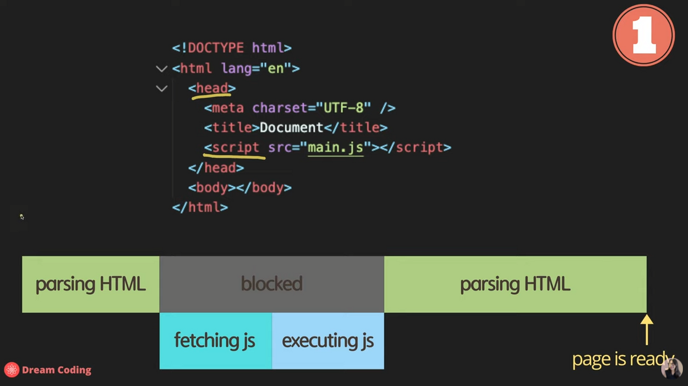
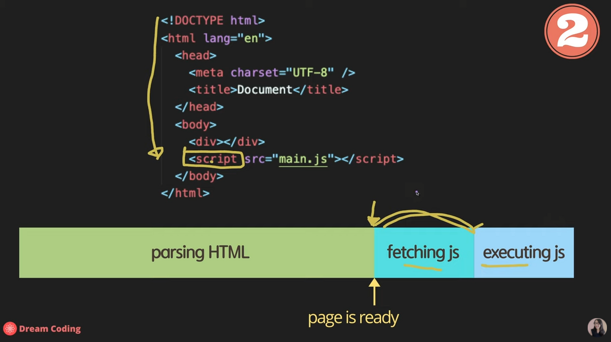
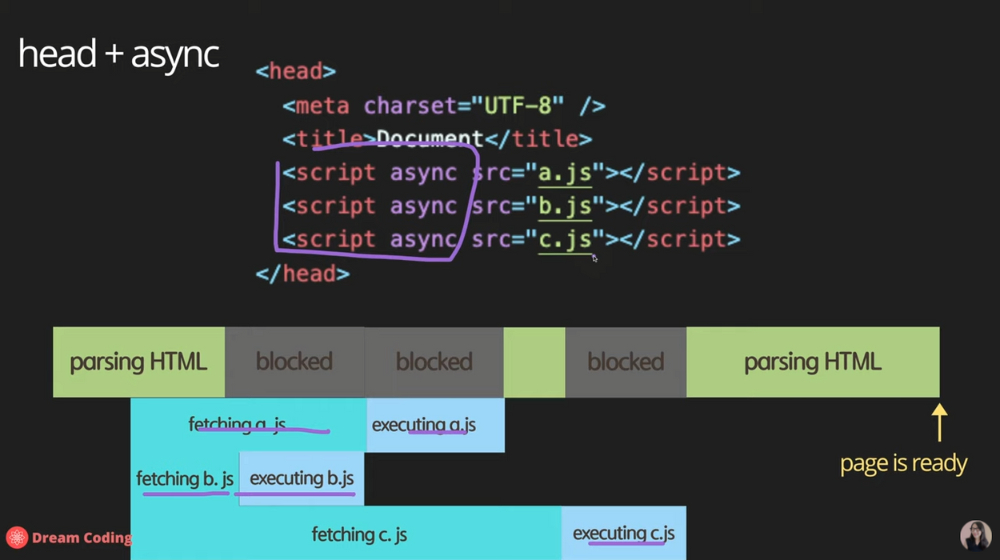
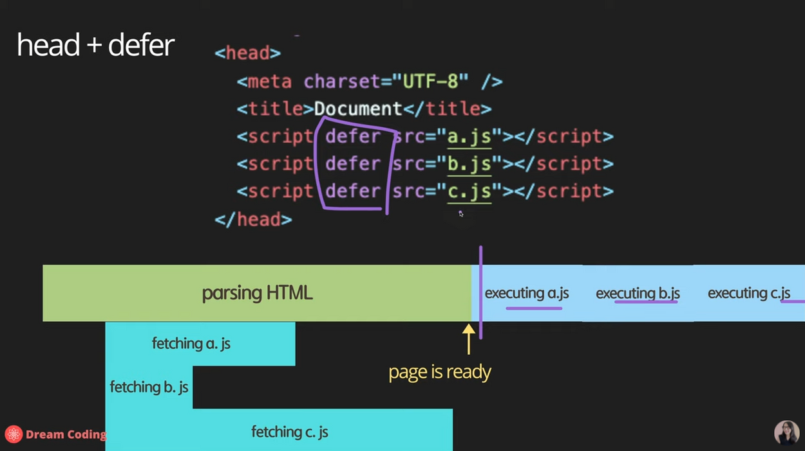

# Reborn Web


## 1주차
* 교수님 면담 & 팀명 정하기
* 컴퓨터공학과 진로 & 취업관련
* 들어가기에 앞서... 어릴때 아이들이 글자를 배우는것을 통해 우리가 어떻게 프로그래밍 언어를 공부해야 되는지 간단하게 볼게요. [당신의 문해력](https://www.ebs.co.kr/tv/show?prodId=135000&lectId=20472581&pageNum=1&srchType=&srchText=&srchYear=&srchMonth=&vodProdId=) 9:40\~10:39 글자를 자르고, 자음,모음으로 쪼개어 이해해요 ,16:15\~17:13 모음이 다른 단어를 찾는건데 지금 우리는 쉽게 구분이 가능하지만 어릴땐 못했었어요 // 영상에는 안나오지만 향후 아이들이 언어를 배울때 바나나 -> 나나바, 사과->과사 이런식으로 응용 // 그림책에서 그림을 보고 먼저 단어 떠올리기, 제목 맞추기 등을 하면서 언어능력을 향상시켜요 // 무언가를 학습할때 remember(know) -> understand -> apply -> analyze -> evaluate -> create 단계를 거쳐요. 여기서 우리는 apply와 analyze(응용) 위주로 학습을 할거에요 // 우리도 웹프로그래밍을 하면서 먼저 각 태그가 어떤 역할을 하는지 알아야해요. 그러기 위해서 아이들이 글자를 쪼개고 자음,모음을 나누어 이해한것처럼 여러 홈페이지에 있는 각 태그들이 무슨역할을 하는지 쪼개서 이해해보고 // 해당 태그를 수정도 해보고 // 태그들의 순서도 바꿔보면서 이것저것 만지고 응용을 하면서 아~ 이렇게하면 이렇게 바뀌는구나를 경험을 해봐야 해요. 그래야지 프로그래밍 실력이 빨리빨리 늘 수 있어요
* vscode 설치및 extension 설치
* html 속성
* layout 만들어보기

### 강의 수준
* 4단계 완벽한 암기
* 3단계 힌트를 주면 알 수 있는 상태
* 2단계 무슨 의미인지 알 수 있는 상태 <- 이수준까지 코드해석을 위해, 이런게 있었다는것을 know
* 1단계 어디서 들어본적 있는 상태

## 2w
* 정보보호 직군 관련 정보
* css를 사용하는 3가지 방법(inline, export ,,,)
* css selector [css selector의 이해](https://flukeout.github.io/)
* [css 우선순위](https://webclub.tistory.com/407)
* background style
* border style
* margin & padding
* block level & inline level
* text & font style
* position
* float
* flexbox
* 가상클라스 & 가상요소
* [css frog](https://flexboxfroggy.com/#ko) 하면서 flex 이해하기
* [google font](https://fonts.google.com/), [font awesome](https://fontawesome.com/icons/google)
* [boot strap](https://getbootstrap.com/) 간단한 사용법


## 3w
* 깃 사용법(UI상으로 배울것)
  1. 초기 아이디 설정(설정 안할시 모르는 unknown 프로필이 커밋한거로 나옴)
   ```
    $ git config --global user.name "ghdic"
    $ git config --global user.email ghdic77@gmail.com
    ```
  1. `git clone (해당 repo URL)` 레포를 내컴퓨터에 복제한다.
  1. `git add 파일이름` 업로드할 파일을 추가한다.
  1. `git commit -m "쓸 메세지"` add한 파일에 어떤일을 한건지 정의
  1. `git push` commit한것들을 실제 깃에 업로드한다.
  1. `git pull` 현재 상태에서 최신상태로 동기화한다.(본인이 수정한건 남음, 충돌할 경우 에러)
  1. `git branch (추가할 브런치 이름)` 브런치를 추가한다
  1. `git checkout (바꿀 브런치 이름)` 브런치를 바꿈
  1. pull request(깃헙 사이트에서) -> 해당 브런치에서 작업을 끝낸경우 한다.(작업이 다 끝나고 merge되면 브런치 삭제!)
* js
  1. script파일 삽입(스크립트 파일이 DOM에 접근 하려는 경우 html파일 파싱 중 실행 되어버리면 에러가 발생!)
    * head에 삽입하는 경우 
    * body에 삽입하는 경우 
    * head + async 삽입하는 경우 
    * head + defer 삽입하는 경우 
  2. 변수 선언 + 자료형 + 호이스팅


## 도움이 될만한 글
[브라우저는 어떻게 동작하는가?](https://d2.naver.com/helloworld/59361)
[웹개발자 로드맵](https://github.com/Han-Kyeol/developer-roadmap-kr-)